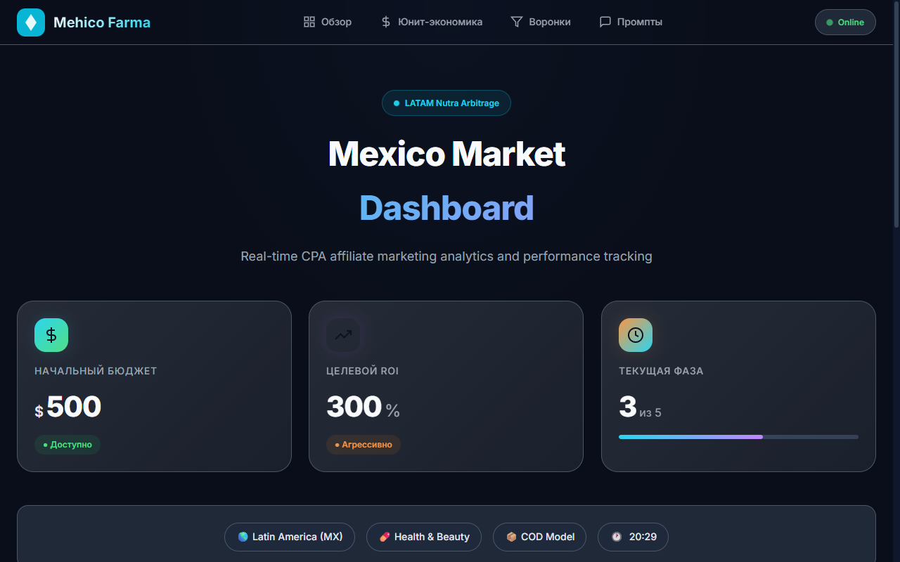

# CPA Analytics Dashboard

Дашборд аналитики рекламных кампаний: юнит-экономика, воронки трафика, библиотека промптов. Статический сайт без бэкенда, все расчёты выполняются на клиенте, состояние хранится в localStorage.

Демо: https://mehicofarma.netlify.app



Клиентский проект. Заказчик и данные кампаний не раскрываются, в репозитории только код дашборда.

## Возможности

- Обзорный дашборд: ключевые метрики, бюджет, спарклайны, цели
- Калькулятор юнит-экономики: ROI, CPL, CPA, Revenue, Profit; пресеты вертикалей и сценарии, экспорт в CSV
- Воронки трафика: параметры кампании слайдерами (CTR, преленд, CR лендинга, аппрув), pipeline конверсии с определением bottleneck, расчёт потенциальной выручки
- Библиотека промптов: фильтры по категориям, поиск по тегам, копирование

## Стек

Vanilla JavaScript (ES6+), CSS Custom Properties, BEM. Внешних зависимостей нет, кроме Google Fonts. Деплой на Netlify: кэширование и security-заголовки настроены в netlify.toml.

## Структура

```
index.html              дашборд
unit-economics.html     калькулятор юнит-экономики
funnels.html            воронки трафика
prompts.html            библиотека промптов
style.css, funnels.css  стили
js/                     app, storage, navigation, unit-economics, funnels, prompt-library
tests.js                тесты
netlify.toml            конфигурация деплоя
```

## Локальный запуск

```bash
npx http-server -p 8080
```

Открыть http://localhost:8080. Сборка не требуется.

## Как собран

Продуктовая логика, формулы и структура спроектированы автором; код написан в связке с Claude Code. Оплаченный клиентский проект, опубликован без раскрытия заказчика.

## Автор

Алексей Черненко — AI-интегратор, Product Engineer. Telegram: [@alex_chnk](https://t.me/alex_chnk), GitHub: [LongWinterNight](https://github.com/LongWinterNight)
